<!-- hero: monochrome ASCII portrait beside the extruded 3D ASCII wordmark -->

<h3><code>yashsaxena-20@github ~ $ whoami</code></h3>

<table>
<tr>
<td valign="top"></td>
<td valign="top"></td>
</tr>
</table>

 
 

<!-- animated contribution graph: real data, boxes reveal cell by cell -->

<h3><code>yashsaxena-20@github ~ $ ./contributions.sh</code></h3>

 
 

<h3><code>yashsaxena-20@github ~ $ ./links.sh</code></h3>

<b>Developer & Tech Enthusiast</b>

 

